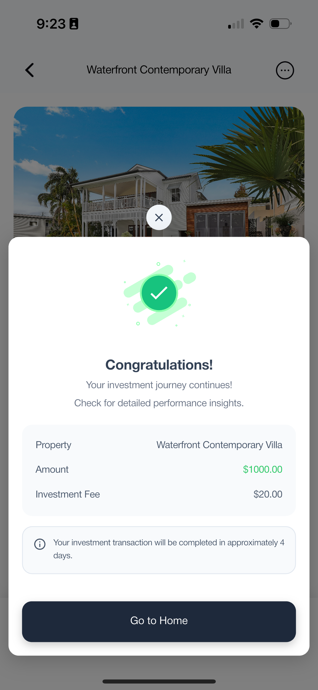
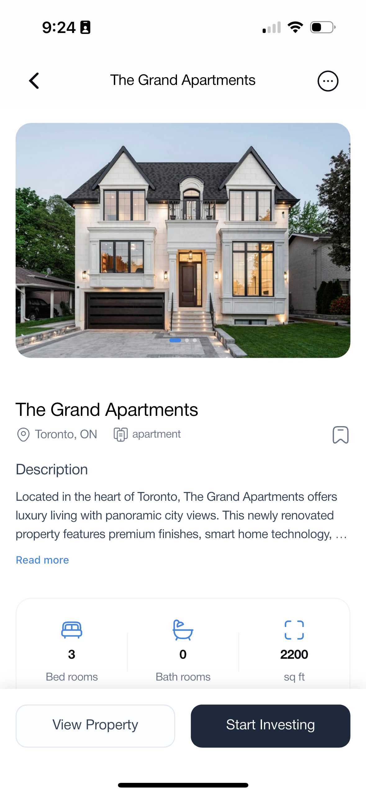
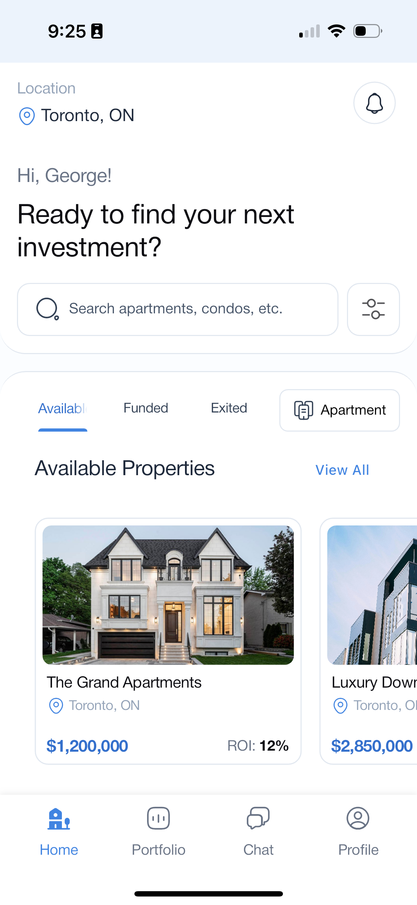
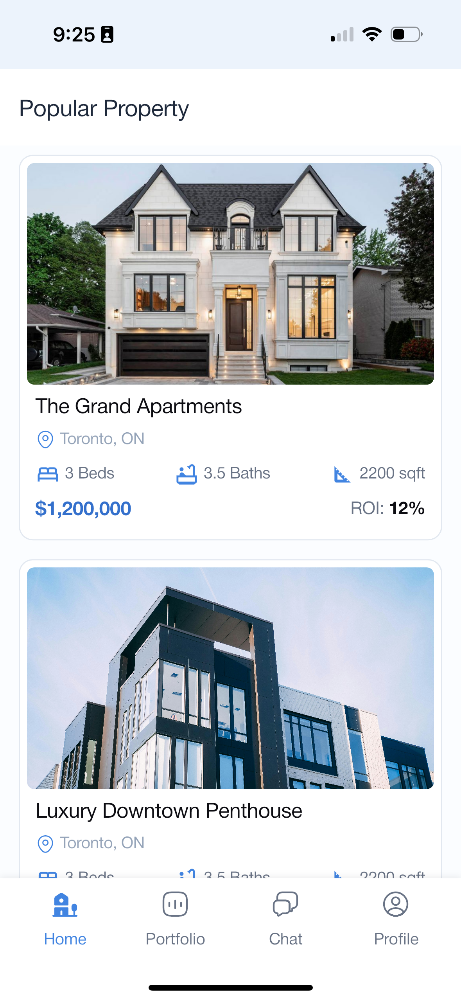
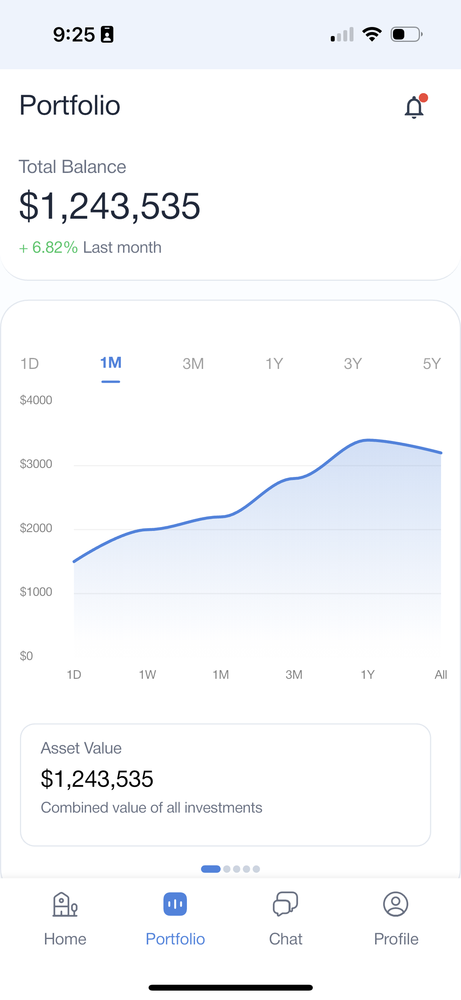
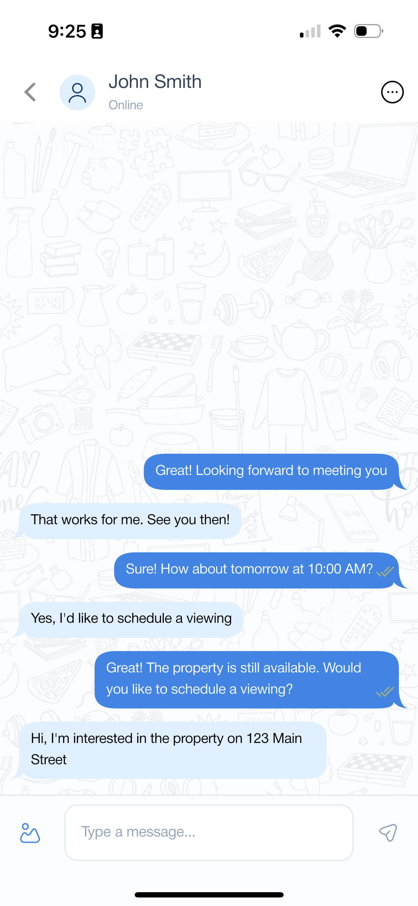
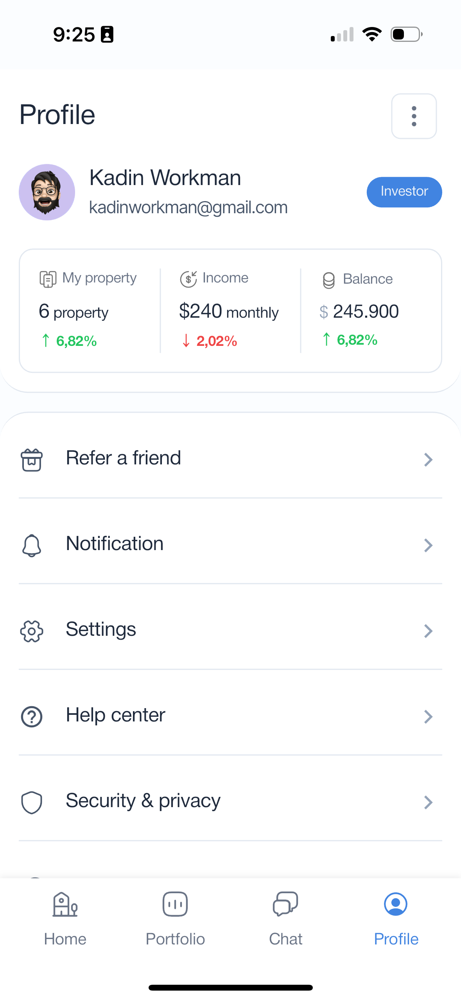

# Juniper - Simplifying Apartment Rentals and Investments  

Juniper is a modern mobile app that bridges the gap between renters, landlords, and real estate investors. With a sleek, user-friendly design and powerful features, Juniper provides a seamless experience for finding apartments, managing listings, and tracking investment opportunities.

---

## Features

### For Renters

- **Smart Search**: Find apartments based on location, budget, and preferences.
- **Detailed Listings**: Access comprehensive apartment details with photos and descriptions.
- **Favorites**: Save and organize your favorite apartments for easy comparison.
- **Onboarding Flow**: Get started with a smooth, guided user experience.

### For Investors

- **Investment Tracking**: Monitor and analyze your real estate investments.
- **Market Insights**: AI-driven insights on price predictions and market trends.
- **Custom Recommendations**: Tailored suggestions based on investment goals.

### For Landlords

- **Easy Management**: List and manage your properties efficiently.
- **Data Analytics**: Gain insights into market performance and property visibility.

---

## Demo

Here are some screenshots of the Juniper app in action:

<p align="center">
  
  
  
  
  
  
  
</p>

### Demo Video

<p align="center">
  <video width="400" controls>
    <source src="demo/demo_video.mp4" type="video/mp4">
    Your browser does not support the video tag.
  </video>
</p>

---

## Technology Stack

- **Framework**: Flutter
- **Architecture**: Clean Architecture
- **State Management**: BLoC
- **APIs/Data**: Real-time apartment listings through web scraping or external APIs
- **AI Features**: Powered by machine learning for recommendations and price predictions

---

## Installation and Setup

### Prerequisites

- Flutter SDK (latest stable version)
- Dart (latest stable version)

### Steps to Run

1. Clone the repository:

   ```bash
   git clone https://github.com/yourusername/juniper.git

2. Navigate to the project directory:

   ```bash
   cd juniper

3. Get the dependencies:

   ```bash
   flutter pub get

4. Run the app:

 ```bash
 flutter run

Project Structure

The project follows Clean Architecture with a modular folder structure:

lib/
├── core/                # Utilities, constants, themes, and shared components
├── features/
│   ├── search/          # Smart search and filtering functionality
│   ├── favorites/       # Favorite apartments and saved searches
│   ├── investment/      # Investment tracking and analytics
│   ├── onboarding/      # Onboarding screens and flow
├── presentation/        # UI layers and widgets

Future Roadmap
 • Implement AI-powered apartment recommendations
 • Integrate advanced investment analytics
 • Add support for property sharing and collaboration
 • Expand market coverage for listings
 • Enable real-time chat between renters and landlords

Contributing

We welcome contributions from the community! To contribute:

 1. Fork the repository
 2. Create a new branch for your feature/bugfix
 3. Commit your changes and submit a pull request

License

This project is licensed under the MIT License. See the LICENSE file for more details.

Contact

For questions or feedback, feel free to reach out:
 • Author: Daniel
 • Email: <dbabs297@gmail.com>
 • LinkedIn: in/dannybabs
